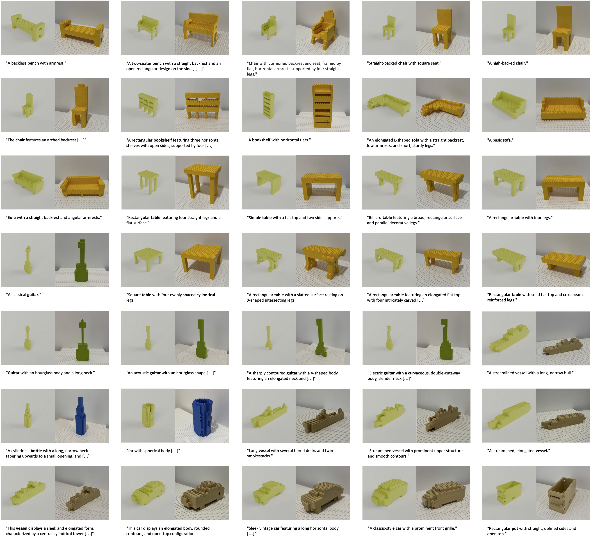
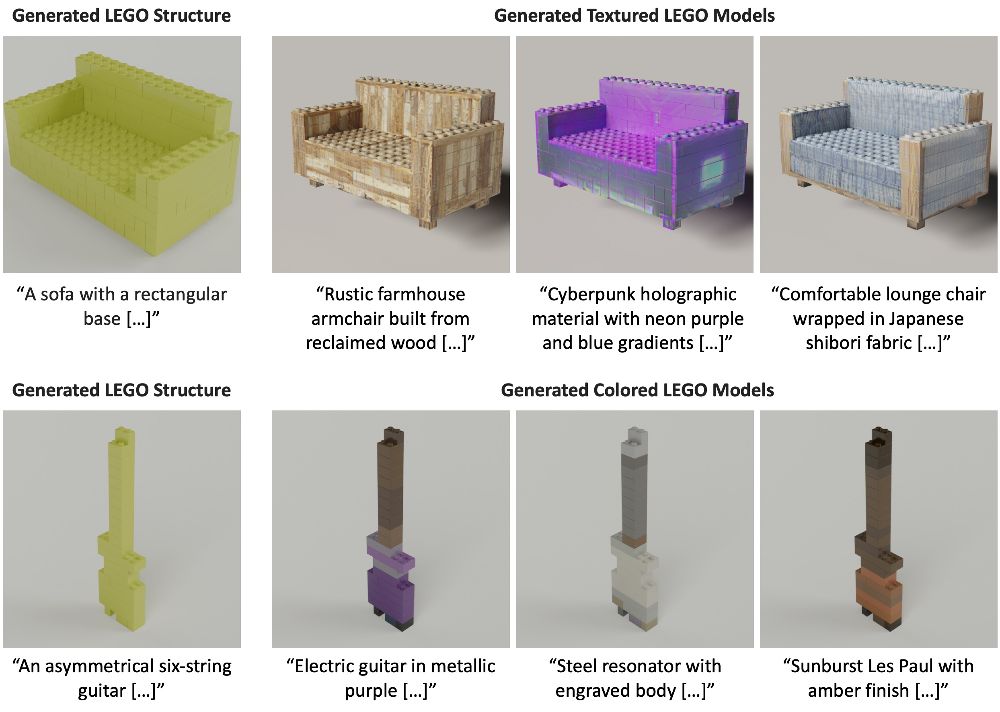

# BrickGPT

***Generating Physically Stable and Buildable Brick Structures from Text***  
**ICCV 2025**  
[Ava Pun*](https://avapun.com/),
[Kangle Deng*](https://dunbar12138.github.io/),
[Ruixuan Liu*](https://waynekyrie.github.io/),
[Deva Ramanan](https://www.cs.cmu.edu/~deva/),
[Changliu Liu](https://www.ri.cmu.edu/ri-faculty/changliu-liu/),
[Jun-Yan Zhu](https://www.cs.cmu.edu/~junyanz/)  
Carnegie Mellon University

[](https://arxiv.org/abs/2505.05469)
[](https://avalovelace1.github.io/BrickGPT/)
[](https://huggingface.co/spaces/cmu-gil/BrickGPT-Demo)
[](https://huggingface.co/datasets/AvaLovelace/StableText2Brick)
[](https://github.com/AvaLovelace1/BrickGPT/blob/main/LICENSE)

---

This is the official repository for **BrickGPT**, the first approach for generating physically stable toy
brick models from text prompts.

<video src='https://github.com/user-attachments/assets/6760f55c-a413-4baf-abf1-2ad61bb1a427' width=480/></video>

## Results

Examples of generated brick structures assembled by humans:



Examples of textured and colored brick models:



## Installation

### Prerequisites

- **Llama-3.2-1B-Instruct:** BrickGPT is fine-tuned from meta-llama/Llama-3.2-1B-Instruct, a gated
  model. [Request access to the model](https://huggingface.co/meta-llama/Llama-3.2-1B-Instruct), then generate
  a [Hugging Face user access token](https://huggingface.co/docs/hub/en/security-tokens) and set it as an environment
  variable: `export HF_TOKEN=<your_token>`. The model will be automatically downloaded upon running the code.
- **Gurobi (optional but recommended):** Running stability analysis requires
  a [Gurobi license](https://www.gurobi.com/downloads/) to use Gurobi. Academics may request a free license from the
  [Gurobi website](https://www.gurobi.com/academia/academic-program-and-licenses/); after obtaining the license,
  place it in your *home directory* or
  another [recommended location](https://support.gurobi.com/hc/en-us/articles/360013417211-Where-do-I-place-the-Gurobi-license-file-gurobi-lic).
    - If you do not have access to Gurobi, you can run the code with the option `--use_gurobi False` to use a simpler
      but less accurate connectivity-based method instead of physics-based stability analysis.

### Installing as a standalone project

This repo uses the Python project manager [uv](https://docs.astral.sh/uv/). To install this repo as a standalone
project, first install all prerequisites. Then,

1. Clone the repo: `git clone https://github.com/AvaLovelace1/BrickGPT.git && cd BrickGPT`.
2. *(Optional, required for running the `infer` script and texturing)* Follow these instructions to install ImportLDraw,
   required for rendering brick structure visualizations:
    - Install the ImportLDraw submodule with `git submodule update --init`.
    - Download
      this [background exr file](https://drive.google.com/file/d/1Yux0sEqWVpXGMT9Z5J094ISfvxhH-_5K/view?usp=share_link)
      and place it in the `ImportLDraw/loadldraw` subdirectory.
    - Download the [LDraw parts library](https://library.ldraw.org/library/updates/complete.zip) and
      extract it in your *home directory*:
      `(cd ~ && wget https://library.ldraw.org/library/updates/complete.zip && unzip complete.zip)`.
        - If you wish to put the LDraw parts library in a different directory, set the environment variable
          `LDRAW_LIBRARY_PATH` to the path of the `ldraw` directory: `export LDRAW_LIBRARY_PATH=path/to/ldraw`.
3. Finally, [install uv](https://docs.astral.sh/uv/getting-started/installation/), and run `uv sync` to create a Python
   virtual environment with all dependencies installed. Python dependencies are defined in `pyproject.toml`.

### Installing as a package

To install this repo as a package in your own Python project, first install all prerequisites. Then, run

```zsh
uv add "https://github.com/AvaLovelace1/BrickGPT.git"
```

if using uv, or

```zsh
pip install "https://github.com/AvaLovelace1/BrickGPT.git"
```

if using pip.

## Running inference interactively

You can run inference with the fine-tuned BrickGPT model using:

```zsh
uv run infer
```

This script starts an interactive session where you can input a prompt and get a response from the model.
The [model weights](https://huggingface.co/AvaLovelace/BrickGPT) will automatically be downloaded from Hugging Face.

If you wish to run inference with a different set of model weights, specify them using the `--model_name_or_path`
option. See `uv run infer -h` for a full list of options.

### Example interaction

Here is an example interaction using the `infer` script:

```text
> uv run infer
Enter a prompt, or <Return> to exit: Table featuring a flat rectangular surface over four evenly spaced legs.
Enter a filename to save the output image (default=output.png): output.png
Enter a generation seed (default=42): 42
Generating...
Set parameter Username
Academic license - for non-commercial use only - expires 2026-02-19
--------------------
Finished generating in 63.53s.
Total # bricks: 59
Total # brick rejections: 98
Brick rejection reasons: {'collision': 5, 'already_rejected': 93}
Total # regenerations: 4
Saved results to /home/apun/BrickGPT/output.txt, /home/apun/BrickGPT/output.ldr, and /home/apun/BrickGPT/output.png
--------------------
Enter another prompt, or <Return> to exit:
```

Three output files are created: `output.png`, `output.txt`, and `output.ldr`.

`output.png` contains a rendered image of the generated brick structure:


`output.txt` contains the brick structure in brick-by-brick text format, where each line of the form `hxw (x,y,z)`
represents a brick of height `h` and width `w` at position `(x,y,z)`:

```text
1x2 (16,18,0)
1x2 (16,13,0)
2x2 (0,18,0)
2x2 (0,13,0)
1x2 (16,18,1)
[...]
```

And finally, `output.ldr` contains the brick structure in LDraw format, which can be opened with any LDraw-compatible
software.

## Running texturing

The subdirectory `src/texture` contains the code for generating the UV texture or per-brick color given a brick design.
To run texturing, `cd` into [src/texture](src/texture) and follow the instructions in the `README.md` file there.

## Running mesh-to-brick

The subdirectory `src/mesh2brick` contains the code for converting a 3D object mesh into a brick structure.
To run mesh-to-brick, `cd` into [src/mesh2brick](src/mesh2brick) and follow the instructions in the `README.md` file
there.

## Running fine-tuning

BrickGPT was created by
fine-tuning [Llama-3.2-1B-Instruct](https://huggingface.co/meta-llama/Llama-3.2-1B-Instruct)
on the custom brick structure dataset [StableText2Brick](https://huggingface.co/datasets/AvaLovelace/StableText2Brick),
converted
into instructional format. We used Hugging Face [TRL](https://huggingface.co/docs/trl/index)
with [Accelerate](https://huggingface.co/docs/accelerate/index) for fine-tuning.

To replicate the fine-tuning process, first install additional Python dependencies with `uv sync --extra finetuning`.
Then, follow these instructions:

1. Prepare the brick structure dataset for fine-tuning with
   `uv run prepare_finetuning_dataset --input_path AvaLovelace/StableText2Brick --output_path [FINETUNING_DATASET_PATH]`.
   This converts the dataset into the instructional format required for fine-tuning LLaMA.
    - If you wish to run fine-tuning with your own brick structure dataset, replace `AvaLovelace/StableText2Brick` with
      the path to
      your dataset. This dataset should have the fields "captions" and "bricks". The "bricks" field should contain a
      brick
      structure in the text format described in the paper, and the "captions" field should contain a list of one or more
      descriptions of the brick structure.
2. Download the pretrained [Llama-3.2-1B-Instruct model](https://huggingface.co/meta-llama/Llama-3.2-1B-Instruct) to
   some directory `[PRETRAINED_DIR]`.
   **IMPORTANT:** Replace the `config.json`, `special_tokens_map.json`, and `tokenizer_config.json` files with the ones
   in the `finetuning_config_files` directory. This specifies the `pad_token` to be different from the `eos_token`,
   fixing a fine-tuning [issue](https://github.com/unslothai/unsloth/issues/416) where the model will not learn to
   output EOS tokens properly.
3. Initialize the Accelerate config file with `uv run accelerate config`.
4. Run fine-tuning with
   `uv run ./scripts/finetune.zsh [PRETRAINED_DIR] [OUTPUT_DIR] [RUN_NAME] [FINETUNING_DATASET_PATH]`. The
   fine-tuned model will be saved to `[OUTPUT_DIR]/[RUN_NAME]`.

## License

The BrickGPT model, StableText2Brick dataset, and majority of the BrickGPT code are licensed under
the [MIT License](https://github.com/AvaLovelace1/BrickGPT/blob/main/LICENSE). The following submodules may have
different licenses:

- **[ImportLDraw](https://github.com/TobyLobster/ImportLDraw)**: For visualizing brick structures, we used ImportLDraw,
  available under the [LICENSE](https://github.com/TobyLobster/ImportLDraw/blob/master/LICENSE).
- **[FlashTex](https://github.com/Roblox/FlashTex)**: For texturing and coloring, we used FlashTex, available under
  the [LICENSE](https://github.com/Roblox/FlashTex/blob/main/LICENSE).

## Citation

If you find this repository useful for your research, please cite the following work.

```bibtex
@inproceedings{pun2025brickgpt,
    title     = {Generating Physically Stable and Buildable Brick Structures from Text},
    author    = {Pun, Ava and Deng, Kangle and Liu, Ruixuan and Ramanan, Deva and Liu, Changliu and Zhu, Jun-Yan},
    booktitle = {ICCV},
    year      = {2025}
}
```

## Acknowledgements

We thank Minchen Li, Ken Goldberg, Nupur Kumari, Ruihan Gao, and Yihao Shi for their discussions and help.  
We also thank Jiaoyang Li, Philip Huang, and Shobhit Aggarwal for developing the bimanual robotic system.
This work is partly supported by the Packard Foundation, Cisco Research Grant, and Amazon Faculty Award. This work is
also in part supported by the Manufacturing Futures Institute, Carnegie Mellon University, through a grant from the
Richard King Mellon Foundation. KD is supported by the Microsoft Research PhD Fellowship.

Our codebase is built upon several amazing repos:  Hugging
Face [TRL](https://huggingface.co/docs/trl/index), [Accelerate](https://huggingface.co/docs/accelerate/index), [ImportLDraw](https://github.com/TobyLobster/ImportLDraw).
